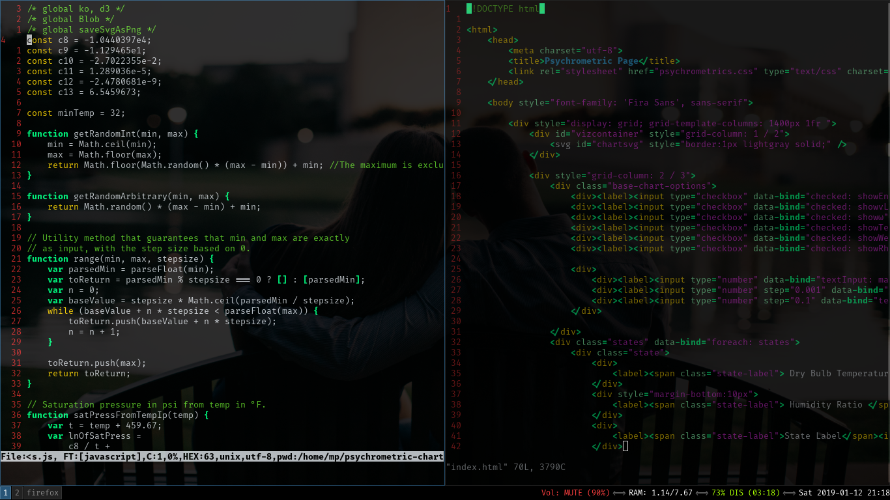

# Sensible.vim - A sensible color scheme.

This is my personal color scheme for Vim. 

Thoughts:
* Only use the 16 base terminal colors.
* Focus on the terminal specifications.
* `SpellBad` doesn't use background highlighting, just bold red and
  underlined.

Note: I only use this color scheme for terminal vim. Since it relies on
the base 16 colors, your mileage may vary. 

The actual colors that I use:

```
color0      #1C2023
color1      #CC2929
color2      #5FCC29
color3      #CCB129
color4      #2996CC
color5      #CC29CC
color6      #29CC7A
color7      #C7CCD1
color8      #747C84
color9      #FF0000
color10     #55FF00
color11     #FFD500
color12     #00AAFF
color13     #FF00FF
color14     #00FF80
color15     #F3F4F5
```

What it looks like for me:


